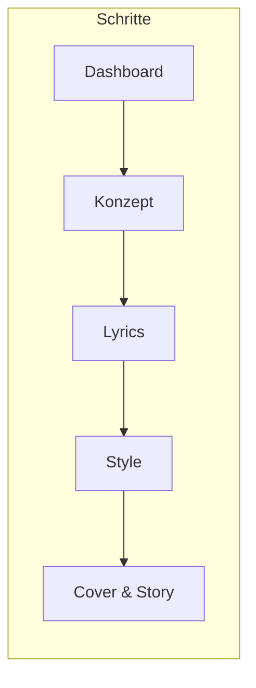
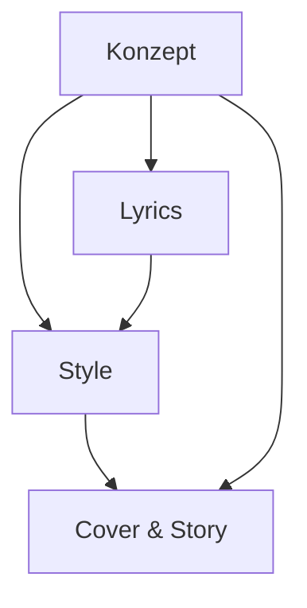

# Suno Mastermind – Tutorial

Dieses Tutorial erklärt **Funktionen**, **Bedienung** und **Zusammenhänge** der App – damit du schnell vom Konzept bis zum fertigen Suno-Song kommst.

---

## 1. Überblick

Suno Mastermind bereitet alles vor, was du für **Suno** (suno.com) brauchst:

| Lieferung | Beschreibung |
|-----------|--------------|
| **Konzept** | Thema, Genre, Stimmung, Tempo, Instrumente |
| **Lyrics** | Songtext mit Regieanweisungen in `[ ]` |
| **Style-Prompt** | Text für Sunos Style-Feld |
| **Cover & Story** | Optional: Cover-Bild und kurze Song-Beschreibung |

Die **KI (Google Gemini)** unterstützt bei Analyse, Text und Bild. Dein **eigener API-Key** (BYOK) wird nur lokal im Browser gespeichert.

---

## 2. Der Ablauf

Die App führt dich in **fünf Schritten** vom Start bis zum Kopieren nach Suno:

| Schritt | Inhalt | KI unterstützt |
|---------|--------|----------------|
| **Dashboard** | Start, Archiv, Neues Projekt, Tutorial | — |
| **Konzept** | Idee + Details (Genre, Mood, Tempo, …) | Thema, Analyse, Referenz-Mixer, Fusion, Boost |
| **Lyrics** | Zwei Varianten wählen, Regie anreichern | Text + Regie |
| **Style** | Prompt zu Lyric A/B, anreichern, würfeln | Style-Text |
| **Cover & Story** | Bild, Story, Copy-Pills für Suno | Cover (optional) |

Die **Navigation** oben springt zwischen den Schritten. Ein Schritt wird erst nutzbar, wenn die nötigen Daten da sind (z. B. Lyrics nach Konzept + Create).

---

## 3. Beziehungen der Teilbereiche

Das **Konzept** ist die Steuerzentrale: Alle KI-Aufgaben (Lyrics, Style, Cover) bauen darauf auf.

| Bereich | Braucht | Liefert |
|---------|---------|----------|
| **Dashboard** | — | Einstieg, Archiv, Neues Projekt |
| **Konzept** | (optional: nichts) | Thema, Genre, Mood, Tempo, Instrumente, Sprache, Vocals |
| **Lyrics** | Konzept (nach Create) | Text + Regie für Style & Suno |
| **Style** | Konzept + Lyrics | Style-Prompt, Song-Beschreibung |
| **Cover & Story** | Konzept + Style | Cover, Story, Copy-Pills |

> **Wichtig:** Änderungen im Konzept wirken sich aus, sobald du neu generierst. Wenn du den Stil aus dem **Referenz-Mixer** behalten willst, nicht **KI-Inspiration** klicken – die überschreibt die Detail-Felder.

---

## 4. Schritt für Schritt

### 4.1 Dashboard

| Element | Funktion |
|---------|----------|
| **„Dein Song beginnt hier“** | Einstiegsbereich |
| **Neues Projekt** | Alles zurücksetzen, Sprung zum Konzept |
| **Tutorial** | Kurze Erklärung der Schritte (Modal) |
| **Was ist neu** | Neueste Funktionen (Modal) |
| **Archiv** | Songs wieder aufrufen, exportieren/importieren, alle löschen |

---

### 4.2 Konzept

Hier legst du die **Grundlage** fest: wovon der Song handelt und wie er klingen soll.

#### Song-Idee (oberer Bereich)

| Element | Beschreibung |
|---------|--------------|
| **Textfeld** | Thema (z. B. „Sommerregen“, „Abschied am Bahnhof“). Leer lassen → KI erfindet beim Create ein Thema. |
| **Lyrics / Instrumental** | Umschalter: mit Gesang oder nur Instrumental. |
| **Referenz-Audio** | Eine Datei hochladen → KI analysiert Genre, Tempo, Stimmung, Instrumente. |
| **Würfel** | Kategorie wählen → KI liefert ein neues Thema ins Textfeld. |
| **KI-Inspiration** | KI analysiert **nur das Thema** und füllt Genre, Mood, Tempo, Instrumente. Überschreibt bestehende Details. |
| **Kreativ-Boost** | KI schlägt einen unerwarteten Twist vor (z. B. Instrument, Stimmung); „Twist übernehmen“ oder „Nein danke“. |

#### Referenz-Mixer (einklappbar)

- Bis zu **3 Referenzen**: pro Slot **Datei** hochladen oder **Suno-Link** einfügen (auch Share-Link `suno.com/s/…`).
- Pro Referenz: **Analysieren** → KI erkennt Genre, Mood, Tempo, Instrumente.
- **Stil synthetisieren** → KI fasst die gemeinsame „Stil-DNA“ zusammen.
- **Auf Konzept anwenden** → Werte werden in die Detail-Felder übernommen (additiv).

#### Details (unterer Bereich)

- **Genre(s), Stimmung(en), Sprache(n), Gesangsstil, Tempo, Instrumente** – optional, manuell oder von KI/Referenz füllen.
- **Genre-Fusion** – ab 2 Genres: Hybrid-Stil (Name, BPM, Instrumente, Mood) mit „Übernehmen“ / „Verwerfen“.
- **Ausschließen** – Stile, die die KI nicht verwenden soll.

#### Create-Button

Ein Klick startet: **Thema** (oder Zufall) → **Analyse** → **zwei Lyrics-Varianten** → **zwei Style-Varianten**. Danach wechselt die App automatisch zu **Lyrics**.

---

### 4.3 Lyrics

Nach **Create** siehst du **zwei Varianten** (A und B). Beide basieren auf dem gleichen Konzept.

| Aktion | Beschreibung |
|--------|--------------|
| **Variante wählen** | „Diese wählen“ bei A oder B → gewählte Variante ist aktiv für Style und Suno. |
| **Regie anreichern** | Pro Variante: KI ergänzt nur die Regie-Tags in `[ ]`, lässt den gesungenen Text weitgehend unverändert. |
| **Neu generieren (Würfel)** | Diese eine Variante komplett neu erzeugen (gleiches Konzept). |
| **Text bearbeiten** | Lyrics sind editierbar; Änderungen bleiben für Style und Copy-Pills erhalten. |

Die **Style-Varianten** (nächster Schritt) sind je einer Lyric-Variante zugeordnet.

---

### 4.4 Style

Hier siehst du den **Style-Prompt** für Suno plus Weirdness/Influence und **Song-Beschreibung**.

| Aktion | Beschreibung |
|--------|--------------|
| **Zwei Varianten** | Passend zu Lyric A und B; pro Variante bearbeiten, anreichern oder neu würfeln. |
| **Anreichern** | KI macht den Prompt detaillierter (BPM, Feel, Instrumente), ohne den Kern zu ändern. |
| **Würfel** | Diese Style-Variante neu generieren (zum Konzept + zugehöriger Lyric-Variante). |
| **Zeichenlimit** | z. B. „/ 200 empf. · max 1000“ für Suno V 5.5. |

Style-Prompt und Song-Beschreibung fließen in **Cover & Story** ein (Story-Text, Copy-Pills).

---

### 4.5 Cover & Story

| Element | Beschreibung |
|---------|--------------|
| **Cover-Bild** | Von der KI generiert (Thema + Genre + Style). Bei Fehlern (z. B. Quota) erscheint eine Meldung; du bleibst auf der Seite und kannst Copy-Pills weiter nutzen. |
| **Neu generieren** | Neues Cover (optional mit anderem Style). |
| **Song-Story** | Kurze Beschreibung; editierbar. |
| **Copy-Pills** | Tabs „Var 1“ / „Var 2“: vorgefertigte Blöcke (Lyrics + Style) zum Kopieren in Suno. |

Hier läuft alles zusammen; der Song wird im **Archiv** gespeichert (mit beiden Lyric- und Style-Varianten).

---

## 5. Kurz-Checkliste

1. **Dashboard** → Neues Projekt (oder Archiv öffnen).
2. **Konzept** → Thema eintippen oder Würfel / Referenz-Audio / Referenz-Mixer nutzen → Details prüfen → **Create**.
3. **Lyrics** → Variante A oder B wählen → optional Regie anreichern oder neu würfeln → Text ggf. anpassen.
4. **Style** → passenden Prompt wählen/bearbeiten → optional anreichern oder neu würfeln.
5. **Cover & Story** → Cover ansehen/neu generieren, Story anpassen → **Copy-Pills** (Var 1 oder 2) kopieren und in Suno einfügen, Cover in Suno hochladen.

Damit hast du alle Funktionen und Zusammenhänge im Überblick.
